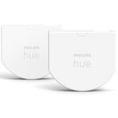

*To contribute to this page, edit the following
[file](https://github.com/Koenkk/zigbee2mqtt.io/blob/master/docs/devices/929003017102.md)*

# Philips 929003017102

| Model | 929003017102  |
| Vendor  | Philips  |
| Description | Hue wall switch module |
| Exposes | battery, action, device_mode, linkquality |
| Picture |  |

## Notes

None

## OTA updates
This device supports OTA updates, for more information see [OTA updates](../information/ota_updates.md).


## Exposes

### Battery (numeric)
Remaining battery in %.
Value can be found in the published state on the `battery` property.
It's not possible to read (`/get`) or write (`/set`) this value.
The minimal value is `0` and the maximum value is `100`.
The unit of this value is `%`.

### Action (enum)
Triggered action (e.g. a button click).
Value can be found in the published state on the `action` property.
It's not possible to read (`/get`) or write (`/set`) this value.
The possible values are: `left_press`, `left_press_release`, `right_press`, `right_press_release`.

### Device_mode (enum)
Value can be found in the published state on the `device_mode` property.
To read (`/get`) the value publish a message to topic `zigbee2mqtt/FRIENDLY_NAME/get` with payload `{"device_mode": ""}`.
To write (`/set`) a value publish a message to topic `zigbee2mqtt/FRIENDLY_NAME/set` with payload `{"device_mode": NEW_VALUE}`.
The possible values are: `single_rocker`, `single_push_button`, `dual_rocker`, `dual_push_button`.

### Linkquality (numeric)
Link quality (signal strength).
Value can be found in the published state on the `linkquality` property.
It's not possible to read (`/get`) or write (`/set`) this value.
The minimal value is `0` and the maximum value is `255`.
The unit of this value is `lqi`.

## Manual Home Assistant configuration
Although Home Assistant integration through [MQTT discovery](../integration/home_assistant) is preferred,
manual integration is possible with the following configuration:



```yaml
sensor:
  - platform: "mqtt"
    state_topic: "zigbee2mqtt/<FRIENDLY_NAME>"
    availability_topic: "zigbee2mqtt/bridge/state"
    value_template: "{{ value_json.battery }}"
    unit_of_measurement: "%"
    device_class: "battery"

sensor:
  - platform: "mqtt"
    state_topic: "zigbee2mqtt/<FRIENDLY_NAME>"
    availability_topic: "zigbee2mqtt/bridge/state"
    value_template: "{{ value_json.action }}"
    icon: "mdi:gesture-double-tap"

sensor:
  - platform: "mqtt"
    state_topic: "zigbee2mqtt/<FRIENDLY_NAME>"
    availability_topic: "zigbee2mqtt/bridge/state"
    value_template: "{{ value_json.device_mode }}"

sensor:
  - platform: "mqtt"
    state_topic: "zigbee2mqtt/<FRIENDLY_NAME>"
    availability_topic: "zigbee2mqtt/bridge/state"
    value_template: "{{ value_json.linkquality }}"
    unit_of_measurement: "lqi"
    icon: "mdi:signal"

sensor:
  - platform: "mqtt"
    state_topic: "zigbee2mqtt/<FRIENDLY_NAME>"
    availability_topic: "zigbee2mqtt/bridge/state"
    icon: "mdi:update"
    value_template: "{{ value_json['update']['state'] }}"

binary_sensor:
  - platform: "mqtt"
    state_topic: "zigbee2mqtt/<FRIENDLY_NAME>"
    availability_topic: "zigbee2mqtt/bridge/state"
    payload_on: true
    payload_off: false
    value_template: "{{ value_json.update_available}}"
```



