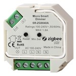

*To contribute to this page, edit the following
[file](https://github.com/Koenkk/zigbee2mqtt.io/blob/master/docs/devices/SR-ZG9040A.md)*

# Sunricher SR-ZG9040A

| Model | SR-ZG9040A  |
| Vendor  | Sunricher  |
| Description | Zigbee micro smart dimmer |
| Exposes | light (state, brightness), power, voltage, current, energy, linkquality |
| Picture |  |

## Notes

### Device type specific configuration
*[How to use device type specific configuration](../information/configuration.md)*

* `transition`: Controls the transition time (in seconds) of on/off, brightness,
color temperature (if applicable) and color (if applicable) changes. Defaults to `0` (no transition).
Note that this value is overridden if a `transition` value is present in the MQTT command payload.


## Exposes

### Light 
This light supports the following features: `state`, `brightness`.
- `state`: To control the state publish a message to topic `zigbee2mqtt/FRIENDLY_NAME/set` with payload `{"state": "ON"}`, `{"state": "OFF"}` or `{"state": "TOGGLE"}`. To read the state send a message to `zigbee2mqtt/FRIENDLY_NAME/get` with payload `{"state": ""}`.
- `brightness`: To control the brightness publish a message to topic `zigbee2mqtt/FRIENDLY_NAME/set` with payload `{"brightness": VALUE}` where `VALUE` is a number between `0` and `254`. To read the brightness send a message to `zigbee2mqtt/FRIENDLY_NAME/get` with payload `{"brightness": ""}`.

#### Transition
For all of the above mentioned features it is possible to do a transition of the value over time. To do this add an additional property `transition` to the payload which is the transition time in seconds.
Examples: `{"brightness":156,"transition":3}`, `{"color_temp":241,"transition":1}`.

#### Moving/stepping
Instead of setting a value (e.g. brightness) directly it is also possible to:
- move: this will automatically move the value over time, to stop send value `stop` or `0`.
- step: this will increment/decrement the current value by the given one.

The direction of move and step can be either up or down, provide a negative value to move/step down, a positive value to move/step up.
To do this send a payload like below to `zigbee2mqtt/FRIENDLY_NAME/set`

**NOTE**: brightness move/step will stop at the minimum brightness and won't turn on the light when it's off. In this case use `brightness_move_onoff`/`brightness_step_onoff`
````js
{
  "brightness_move": -40, // Starts moving brightness down at 40 units per second
  "brightness_move": 0, // Stop moving brightness
  "brightness_step": 40 // Increases brightness by 40
}
````

### Power (numeric)
Instantaneous measured power.
Value can be found in the published state on the `power` property.
It's not possible to read (`/get`) or write (`/set`) this value.
The unit of this value is `W`.

### Voltage (numeric)
Measured electrical potential value.
Value can be found in the published state on the `voltage` property.
It's not possible to read (`/get`) or write (`/set`) this value.
The unit of this value is `V`.

### Current (numeric)
Instantaneous measured electrical current.
Value can be found in the published state on the `current` property.
It's not possible to read (`/get`) or write (`/set`) this value.
The unit of this value is `A`.

### Energy (numeric)
Sum of consumed energy.
Value can be found in the published state on the `energy` property.
It's not possible to read (`/get`) or write (`/set`) this value.
The unit of this value is `kWh`.

### Linkquality (numeric)
Link quality (signal strength).
Value can be found in the published state on the `linkquality` property.
It's not possible to read (`/get`) or write (`/set`) this value.
The minimal value is `0` and the maximum value is `255`.
The unit of this value is `lqi`.

## Manual Home Assistant configuration
Although Home Assistant integration through [MQTT discovery](../integration/home_assistant) is preferred,
manual integration is possible with the following configuration:



```yaml
light:
  - platform: "mqtt"
    state_topic: "zigbee2mqtt/<FRIENDLY_NAME>"
    availability_topic: "zigbee2mqtt/bridge/state"
    brightness: true
    schema: "json"
    command_topic: "zigbee2mqtt/<FRIENDLY_NAME>/set"
    brightness_scale: 254

sensor:
  - platform: "mqtt"
    state_topic: "zigbee2mqtt/<FRIENDLY_NAME>"
    availability_topic: "zigbee2mqtt/bridge/state"
    value_template: "{{ value_json.power }}"
    unit_of_measurement: "W"
    device_class: "power"

sensor:
  - platform: "mqtt"
    state_topic: "zigbee2mqtt/<FRIENDLY_NAME>"
    availability_topic: "zigbee2mqtt/bridge/state"
    value_template: "{{ value_json.voltage }}"
    unit_of_measurement: "V"
    device_class: "voltage"

sensor:
  - platform: "mqtt"
    state_topic: "zigbee2mqtt/<FRIENDLY_NAME>"
    availability_topic: "zigbee2mqtt/bridge/state"
    value_template: "{{ value_json.current }}"
    unit_of_measurement: "A"
    device_class: "current"

sensor:
  - platform: "mqtt"
    state_topic: "zigbee2mqtt/<FRIENDLY_NAME>"
    availability_topic: "zigbee2mqtt/bridge/state"
    value_template: "{{ value_json.energy }}"
    unit_of_measurement: "kWh"
    device_class: "energy"

sensor:
  - platform: "mqtt"
    state_topic: "zigbee2mqtt/<FRIENDLY_NAME>"
    availability_topic: "zigbee2mqtt/bridge/state"
    value_template: "{{ value_json.linkquality }}"
    unit_of_measurement: "lqi"
    icon: "mdi:signal"
```



